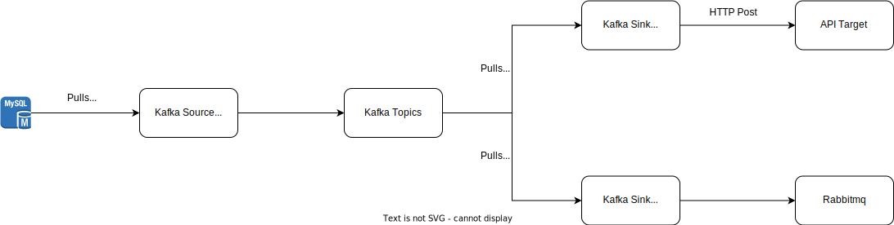

# Kafka Connectors Project

In this project, there will be a MySQL database running as datasource, a Kafka node, a Kafka Connect node where there will be two connectors, one source and one sink, also an API as destination.

The source connector retrieves data from MySQL on incremental mode, and the sink connector gets from the Kafka's topic and sends to an API.

## Access

> Connector
<http://localhost:8083/connectors>

> Kafka Connect
<http://localhost:9021/>

## Architecture

The architecture is the following:

